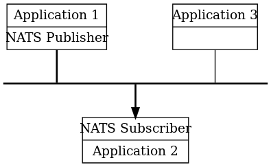
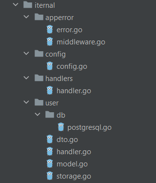

# Голанг 
В рамках данной работы был разработан микросервис для получения данных пользователя на языке golang. 

Golang это многопоточный язык со строгой типизацией. Он был разработан командой Google в 2007 году для улучшения производительности высоконагруженных серверных приложений.

Основное применение данного языка программирования – разработка веб-сервисов и клиент-серверных приложений.

Основные преимущества языка Go:

- Простой и понятный синтаксис.
- Статическая типизация. Позволяет избежать ошибок, допущенных по невнимательности, упрощает чтение и понимание кода, делает код однозначным.
- Скорость и компиляция. Скорость у Go в десятки раз быстрее, чем у скриптовых языков, при меньшем потреблении памяти. Весь проект компилируется в один бинарный файл, без зависимостей. 
- Отход от ООП. В языке нет классов, но есть структуры данных с методами. Наследование заменяется механизмом встраивания. Существуют интерфейсы, которые не нужно явно имплементировать, а лишь достаточно реализовать методы интерфейса.
- Параллелизм. 
- Богатая стандартная библиотека. Количество сторонних библиотек постоянно растет. Кроме того, есть возможность использовать библиотеки C и C++.
- Возможность писать в функциональном стиле. В языке есть замыкания (closures) и анонимные функции. Функции являются объектами первого порядка, их можно передавать в качестве аргументов и использовать в качестве типов данных.
- Open Source

# Архитектура микросервисов


Микросервисы изолируют отдельный функционал в сервис, самодостаточный с точки зрения выполняемой этим сервисом функции. Для совместимости с другими сервисами, он имеет известный и определенный заранее интерфейс.

Микросервисы общаются между собой с помощью сообщений, передаваемых через некоторого посредника, брокера сообщений.



Благодаря микросервисной архитектуре, приложение можно масштабировать не целиком, а частями. Например если сервис вызывается чаще остальных, мы можем увеличить количество его инстансов. Эта концепция отвечаем концепции облачных вычислений и контейнеризации в целом. Для связи всех микросервисов в единое целое используется протокол gRPC — лёгкий, основанный на двоичном коде, что исключает передачу заголовков HTTP, и это сэкономит нам некоторое количество байт. Так же gRPC позволяет определить интерфейс к вашему сервису в дружеском формате — это > protobuf.


# Выбранная база данных 
В качестве базы данных для микросервиса получения данных пользователя был выбран PostgreSQL. PostgreSQL – это объектно-реляционная система управления базами данных. Фундаментальная характеристика объектно-реляционной базы данных – это поддержка пользовательских объектов и их поведение, включая типы данных, функции, операции, домены и индексы. PostgreSQL обрабатывает параллельные клиентские сессии, создавая новые процессы для каждого соединения.

Основные возможности данной базы данных:

- Поддержка множества типов данных
  - Примитивы: Integer, Numeric, String, Boolean
  - Структуры: Date/Time, Array, Range / Multirange, UUID
  - Документы: JSON/JSONB, XML, Key-value (Hstore)
  - Геоментрия: Point, Line, Circle, Polygon
  - Кастомные типы: Composite, Custom Types
- Целостность данных
  - UNIQUE, NOT NULL
  - Основные ключи
  - Ограничение исключений
  - Блокирование данных
- Производительность
  - Индексирование: B деревья, выражения
  - Продвинутое Индексирование: GiST, SP-Gist, KNN Gist, GIN, BRIN, Covering indexes, Bloom filters
  - Передачи данных:  Nested Transactions (via savepoints)
  - Поддержка контроля версий
  - Параллельное чтение деревьев
  - Разделение данных
  - Все транзации по sql стандартам
  - Just-in-time (JIT) компиляция выражений
- Надежность
  - Write-ahead Logging (WAL)
  - Репликация данных: Поддержка асинхронных, Синхронных, Логических
- Безопасность
  - Аунтификация: GSSAPI, SSPI, LDAP, SCRAM-SHA-256, Certificate, and more
  - Надежная система контроля версий
  - Поддержка безопасности на нижнем уровне
  - Мультифакторная аунтификация
- Расширяемость
  - Сохранение функций и процедур
  - Процедурные языки: PL/PGSQL, Perl, Python (and many more)
  - Поддержка SQL/JSON путей
  - Обертка других типов данных: подсоединение к другим базам данных
  - Изменяемый интерфейс хранения данных
- Поддержка языков, Поиск по тексту 
  - Есть поддержка интернациональных языков
  - Поиск без учета регистра
  - Полный поиск по тексту


# Микросервис профиля
Микросервис авторизации в корневой директории проекта имеет три директории: cmd, internal, pkg. Директория cmd содержит исполняемый файл main.go данного микросервиса. Файл main импортирует весь код из папок internal и pkg. 
## директория pkg
Директория pkg содержит код, который направлен на использование всех вспомогательных библиотек, использованных в этом проекте и потенциально может быть использоваться повторно.

В случае этого конкретного микросервиса используются библиотеки отвечающие за логирование, работу с базой данной postgresql и небольшие утилиты, отвечающие за нормальную инициализацию докера. 

Ведение журнала, или логирование  —  очень важная часть программного обеспечения. Логи нужны для отслеживания того, что происходит в системах, и по мере роста последних важность логов только увеличивается. Для логирования в го используются в основном только 3 популярные библиотеки logrus, zap, zerolog и было сделано решение выбрать zerolog. Эта библиотека обеспечивающая простое и легкое логгирование предоставляющее вывод в json обьектах. Она покрыта тестами на 74.3 % и предоставляет 7 уровней логирования от trace до паник 

- panic (zerolog.PanicLevel, 5)
- fatal (zerolog.FatalLevel, 4)
- error (zerolog.ErrorLevel, 3)
- warn (zerolog.WarnLevel, 2)
- info (zerolog.InfoLevel, 1)
- debug (zerolog.DebugLevel, 0)
- trace (zerolog.TraceLevel, -1)

Для того, чтобы предоставить лог с нужным уровнем опасности необходимо ввести команду с нужным уровнем, так напрммер, чтобы ввести лог с уровнем info необходимо ввести
``` go
package main

import (

"github.com/rs/zerolog"

"github.com/rs/zerolog/log"

)

func main() {

zerolog.TimeFieldFormat = zerolog.TimeFormatUnix

log.Info().Msg("hello world")

}


 Output: {"time":1516134303,"level":"info","message":"hello world"}
 ```

Так же, доступна функция поставить общий уровень логирования с помощью команды SetGlobalLevel и пакете zerolog 


Так же система логирования обязательно должна обрабатывать 3 сценария, а именно логирование файла, логирование ошибок и логирование fatal

Зерол позволяет добавлять данные в логи в форме ключ значение. Данные добавленные в сообщение добавляются в контекст, который может быть критичным для дебагинга или других целей, например 

``` go
package main

import (
    "github.com/rs/zerolog"
    "github.com/rs/zerolog/log"
)

func main() {
    zerolog.TimeFieldFormat = zerolog.TimeFormatUnix

    log.Debug().
        Str("Scale", "833 cents").
        Float64("Interval", 833.09).
        Msg("Fibonacci is everywhere")
    
    log.Debug().
        Str("Name", "Tom").
        Send()
}

// Output: {"level":"debug","Scale":"833 cents","Interval":833.09,"time":1562212768,"message":"Fibonacci is everywhere"}
// Output: {"level":"debug","Name":"Tom","time":1562212768}


// Output: {"level":"debug","Scale":"833 cents","Interval":833.09,"time":1562212768,"message":"Fibonacci is everywhere"}

// Output: {"level":"debug","Name":"Tom","time":1562212768}

```
Для обработки ошибок используется следующий код
``` go
package main

import (
	"errors"

	"github.com/rs/zerolog"
	"github.com/rs/zerolog/log"
)

func main() {
	zerolog.TimeFieldFormat = zerolog.TimeFormatUnix

	err := errors.New("seems we have an error here")
	log.Error().Err(err).Msg("")
}

// Output: {"level":"error","error":"seems we have an error here","time":1609085256}
```


В папке utils обычно оставляются самописные файлы, которые необходимы для запуска этого проекта, 

Так в моем проекте оставлено repeatable, который отвечает за комфортный запуск docker, который просто постоянно перезапускает модули, которые не запустились с первого раза, это распространенная проблема и это лишь один из вариантов решения этой проблемы 
``` go
func DoWithTries(fn func() error, attemtps int, delay time.Duration) (err error) {
	for attemtps > 0 {
		if err = fn(); err != nil {
			time.Sleep(delay)
			attemtps--

			continue
		}

		return nil
	}

	return
}
```

последний пакет, который используется в этом микросервисе, это **pgx - PostgreSQL Driver and Toolkit**

pgx это чистый го драйвер и тулкит для postgresql, он направлен на быструю и производительную работу с работой особенностями postgresql,  с которой стандартный пакет database/sql не справляется 

Кроме этого, был выбран этот пакет из за того, что используется только PostgreSQL, и не используются другие библиотеки направленные на использование sql

Эта библиотека поддерживает следующие особенности

- она поддерживает более 70 типов данных postgresql
- поддерживает автоматическое кэширование
- пакетные запросы
- Полный контроль соединения TLS
- Поддержка двоичного формата для пользовательских типов 
- Поддержка протокола COPY для более быстрой загрузки больших объемов данных
- Расширяемая поддержка ведения журналов, включая встроенную поддержку zerolog.
- Пул соединений с хуком после подключения для произвольной настройки соединения
- слушатели и уведомители
- Преобразование массивов PostgreSQL в отображения срезов Go для целых чисел, чисел с плавающей запятой и строк
- Поддержка магазина
- Поддержка JSON и JSONB
- Сопоставляет типы inet и cidr PostgreSQL с net.IPNet и net.IP
- Поддержка крупных объектов
- Сопоставление NULL со структурой Null\* или указателем на указатель
- Поддерживает интерфейсы database/sql.Scanner и database/sql/driver.Valuer для пользовательских типов.
- Уведомление об обработке ответов
- Имитация вложенных транзакций с точками сохранения

## директория cmd

Директория cmd хранит в себе файл main.go, в котором находится небольшая функция main(). Задача этой функции состоит в том, чтобы получить доступ к логированию и настроить его для нормальной работы, получить данные конфигурации, в которых хранится информация о портах и паролях, для подключения базы данных и создания нового инстанса роутера

## директория internal

В директории internal находится весь основной код для работы микросервиса профиля. Директория internal имеет следующую структуру:



- Директория apperror – в ней находится код, который является оберткой над ошибками, а также middlewares;
- Директория сonfig– в данной директории находится файл, хранящий в себе данные, необходимые для получение доступа к базам данным
- Директория handler– содержит все нужные интерфейсы;
- Директория domain – она содержит все, что нужно для работы с профилем от команд, до класса пользователя

рассмотрим теперь каждый файл по подробней

файл еррор содержит переменную для найденной ошибки
``` go
var (
	ErrNotFound = NewAppError(nil, "not found", "", "US-000003")
)
``` 

 структура для определенной ошибки, которая содержит саму ошибку, описание ошибки, комментарий и код ошибки
``` go
type AppError struct {
	Err              error  `json:"-"`
	Message          string `json:"message,omitempty"`
	DeveloperMessage string `json:"developer_message,omitempty"`
	Code             string `json:"code,omitempty"`
}
```

так же этот файл содержит различные методы по обработке ошибок, такие как просто возвращение ошибки, получение ошибки из обертки и побитовый перевод ошибки в нашу структуру 

```go
func (e *AppError) Error() string {
	return e.Message
}

func (e *AppError) Unwrap() error { return e.Err }

func (e *AppError) Marshal() []byte {
	marshal, err := json.Marshal(e)
	if err != nil {
		return nil
	}
	return marshal
}

func NewAppError(err error, message, developerMessage, code string) *AppError {
	return &AppError{
		Err:              err,
		Message:          message,
		DeveloperMessage: developerMessage,
		Code:             code,
	}
}
```
в middleware находится функция занимающаяся основной обработкой ошибки 

``` go
func Middleware(h appHandler) http.HandlerFunc {

  return func(w http.ResponseWriter, r \*http.Request) {

     w.Header().Set("Content-Type", "application/json")

     var appErr \*AppError

     err := h(w, r)

     if err != nil {

        if errors.As(err, &appErr) {

           if errors.Is(err, ErrNotFound) {

              w.WriteHeader(http.*StatusNotFound*)

              w.Write(ErrNotFound.Marshal())


           }

           err = err.(\*AppError)

           w.WriteHeader(http.*StatusBadRequest*)

           w.Write(appErr.Marshal())

           return

        }

        w.WriteHeader(http.*StatusTeapot*)

        w.Write(systemError(err).Marshal())

     }

  }

}
```
если рассматривать файл конфигурации по подробней, то он хранит в себе 

структуру конфигураций, который указывает, на все параметры запуска, порты для прослушек и информацию по нашей базы данных 
``` go
type Config struct {
	IsDebug *bool `yaml:"is_debug" env-required:"true"`
	Listen  struct {
		Type   string `yaml:"type" env-default:"port"`
		BindIP string `yaml:"bind_ip" env-default:"127.0.0.1"`
		Port   string `yaml:"port" env-default:"8080"`
	} `yaml:"listen"`
	Storage StorageConfig `yaml:"storage"`
}

type StorageConfig struct {
	Host     string `json:"host"`
	Port     string `json:"port"`
	Database string `json:"database"`
	Username string `json:"username"`
	Password string `json:"password"`
}
```

также имеется метод, возвращий инстанс настроек 

``` go
func GetConfig() *Config {
	once.Do(func() {
		logger := logging.GetLogger()
		logger.Info("read application configuration")
		instance = &Config{}
		if err := cleanenv.ReadConfig("config.yml", instance); err != nil {
			help, _ := cleanenv.GetDescription(instance, nil)
			logger.Info(help)
			logger.Fatal(err)
		}
	})
	return instance
}

```

в Handler пока находится интерфейс регистрации роутера

``` go
type Handler interface {
	Register(router *httprouter.Router)
}

```

в файле model хранятся все структуры пользователя, 
```go
type DaysInWeek struct {
	DayOfWeek string `json:"dayOfWeek"`
	IsEntered bool   `json:"isEntered"`
	Time      string `json:"time"`
}

type User struct {
	Id              string       `json:"id"`
	Username        string       `json:"username"`
	Email           string       `json:"email"`
	Password        string       `json:"password"`
	Level           string       `json:"level"`
	DaysInRow       string       `json:"daysInRow"`
	DaysInWeek      []DaysInWeek `json:"daysInWeek"`
	DoesSendPushUps bool         `json:"doesSendPushUps"`
	Theme           string       `json:"theme"`
	Language        string       `json:"language"`
	Image           string       `json:"image"`
}
```
в storage реализован интерфейс репозитория, который отвечает, какие команды поддерживает микросервис относительно пользователя
``` go
type Repository interface {
	Create(ctx context.Context, user *User) error
	FindAll(ctx context.Context) (u []User, err error)
	FindOne(ctx context.Context, id string) (User, error)
	Update(ctx context.Context, user User) error
	Delete(ctx context.Context, id string) error
}
```
в postgresql идет основная работа с базой данной моего микросервиса, он содержит реализацию всех функций из storage, а также вспомогательный метод formatQuery, который убирает все пробелы и табы, этот метод необходим для более удобного, а главного удобного понятного написания запросов в postgresql 
``` go
func formatQuery(q string) string {
	return strings.ReplaceAll(strings.ReplaceAll(q, "\t", ""), "\n", " ")
}

func (r *repository) Create(ctx context.Context, user *user.User) error {

	q := `
		INSERT INTO public.user 
				(id, username, email, password, level, daysinrow,daysinweek, doessendpushups, theme, language, image)
		VALUES 
		       ($1, $2, $3, $4, $5, $6, $7, $8, $9, $10, $11)
		RETURNING id
	`
	r.logger.Trace(fmt.Sprintf("SQL Query: %s", formatQuery(q)))
	if err := r.client.QueryRow(ctx, q, user.Id, user.Username, user.Email, user.Password, user.Level, user.DaysInRow, user.DaysInWeek, user.DoesSendPushUps, user.Theme, user.Language, user.Image).Scan(&user.Id); err != nil {
		var pgErr *pgconn.PgError
		if errors.As(err, &pgErr) {
			pgErr = err.(*pgconn.PgError)
			newErr := fmt.Errorf(fmt.Sprintf("SQL Error: %s, Detail: %s, Where: %s, Code: %s, SQLState: %s", pgErr.Message, pgErr.Detail, pgErr.Where, pgErr.Code, pgErr.SQLState()))
			r.logger.Error(newErr)
			return newErr
		}
		return err
	}

	return nil
}
```
фактически все методы занимаются подставлением наших переменных в sql запроса, который создается с помощью ранее опиисанной библиотеки pgconn, разбираая на примере создания пользователя сначала иницилизация метода отображается в логах, потом подставляются переменные в sql запрос, если происходит ошибка, то происходит обертка ошибки, полученная из пакета pgconn.

запрос для поиска одного пользователя
``` go
	q := `
		SELECT id FROM public.user WHERE username = $1 
	`
```
запрос на обновление 
``` go
	q := `
		UPDATE public.user SET email = $2, password = $3, level = $4, daysinrow = $5, daysinweek = $6,  doessendpushups = $7, theme = $8, language = $9, image = $10 WHERE username = $1 returning image
	`
```
запрос на удаление 
``` go
	q := `
		DELETE FROM public.user WHERE username = $1 returning id
	`
```


Hangler занимается связкой нашей main и запросов в базу данных, оборачивает http ответы и  ошибки

все сетевые запросы обрабатываются в методе register, который в зависимости от типа запроса и url строки вызывает разные методы 
``` go
func (h *handler) Register(router *httprouter.Router) {
	router.HandlerFunc(http.MethodPost, usersURL, apperror.Middleware(h.GetList))
	router.HandlerFunc(http.MethodGet, userURL, apperror.Middleware(h.GetUser))
	router.HandlerFunc(http.MethodPut, userURL, apperror.Middleware(h.PutUser))
	router.HandlerFunc(http.MethodDelete, userURL, apperror.Middleware(h.DeleteUser))

}
```
в случае получения отдельного пользователя, вызывается метод GetUser, который получает из тела запроса id и делает с помощью него запрос в бд
``` go
func (h *handler) GetUser(w http.ResponseWriter, r *http.Request) error {
	user, err := h.repository.FindOne(context.TODO(), r.FormValue("username"))
	if err != nil {
		w.WriteHeader(400)
		return err
	}

	allBytes, err := json.Marshal(user)
	if err != nil {
		return err
	}

	w.WriteHeader(http.StatusOK)
	w.Write(allBytes)

	return nil
}
```

в случае получения создания нового пользователя, вызывается метод PutUser, который создает нового пользователя из тела запроса, а потом вызывает метод по внесению пользователя в базу данных.
``` go
func (h *handler) PutUser(w http.ResponseWriter, r *http.Request) error {
	var DaysInWeek []DaysInWeek

	json.Unmarshal([]byte(r.FormValue("DaysInWeek")), &DaysInWeek)

	usr := User{
		Username:        r.FormValue("Username"),
		Email:           r.FormValue("Email"),
		Password:        r.FormValue("Password"),
		Level:           r.FormValue("Level"),
		DaysInRow:       r.FormValue("DaysInRow"),
		DaysInWeek:      DaysInWeek,
		DoesSendPushUps: false,
		Theme:           r.FormValue("Theme"),
		Language:        r.FormValue("Language"),
		Image:           r.FormValue("Image"),
	}
	err := h.repository.Update(context.TODO(), usr)
	if err != nil {
		w.WriteHeader(400)
		return err
	}

	w.WriteHeader(http.StatusOK)
	w.Write([]byte("Operation successful"))

	return nil
}
```

в случае удаления отдельного пользователя, вызывается метод DeleteUser, который получает из тела запроса id и делает с помощью него запрос в бд на удаление 
``` go
func (h *handler) DeleteUser(w http.ResponseWriter, r *http.Request) error {
	err := h.repository.Delete(context.TODO(), r.FormValue("Username"))
	if err != nil {
		fmt.Println(err)

		w.WriteHeader(400)
		return err
	}

	w.WriteHeader(http.StatusOK)
	w.Write([]byte("Operation successful"))

	return nil
}
``` 

Литература:
Применение матрицы и диаграммы компетенций. – URL: https://habr.com/ru/ post/443162/(дата обращения: 16.04.2021).

1. Структурирование вашего приложения Golang: плоская структура против многоуровневой архитектуры – URL: <https://dev-gang.ru/article/strukturirovanie-vashego-prilozhenija-golang-ploskaja-struktura-protiv-mnogourovnevoi-arhitektury-0ddxmdrjws/>
1. Чистая архитектура – URL: <https://habr.com/ru/post/269589/>
1. Набор инструментов Go для работы с микросервисами – URL: [https://medium.com/nuances-of-programming/набор-инструментов-go-для-работы-с-микросервисами-b5b3fe277ba3](https://medium.com/nuances-of-programming/)
1. Построение микросервисной архитектуры на Golang и gRPC, часть 1 – URL: <https://habr.com/ru/post/425653/>
1. Язык Go для начинающих – URL: <https://habr.com/ru/post/219459/>
1. Отличия реляционных и нереляционных баз данных – URL: <https://www.xelent.ru/blog/otlichiya-relyatsionnykh-i-nerelyatsionnykh-baz-dannykh/>
1.PostgreSQL – URL: <https://ru.bmstu.wiki/PostgreSQL>
1. PostgreSQL или MySQL: какая из этих реляционных СУБД лучше впишется в ваш проект – URL: <https://mcs.mail.ru/blog/postgresql-ili-mysql-kakaya-iz-etih-relyacionnyh-subd>
1. Организация файлов веб-приложения на Go – URL: <https://golangify.com/web-project-structure>
1. Standard Go Project Layout – URL: <https://github.com/golang-standards/project-layout/blob/master/README_ru.md>
1. Logrus – URL: <https://github.com/sirupsen/logrus>
1. Логирование, интерфейсы и аллокации в Go – URL: <https://habr.com/ru/company/badoo/blog/328722/>
1. HTTP-заголовки для описания контента – URL: <https://devanych.ru/technologies/http-zagolovki-dlya-opisaniya-kontenta>
1. GORM – URL: <https://github.com/go-gorm/gorm>
1. pgx - PostgreSQL Driver and Toolkit – URL: <https://github.com/jackc/pgx>
1. pq - A pure Go postgres driver for Go's database/sql package– URL: <https://github.com/lib/pq>

